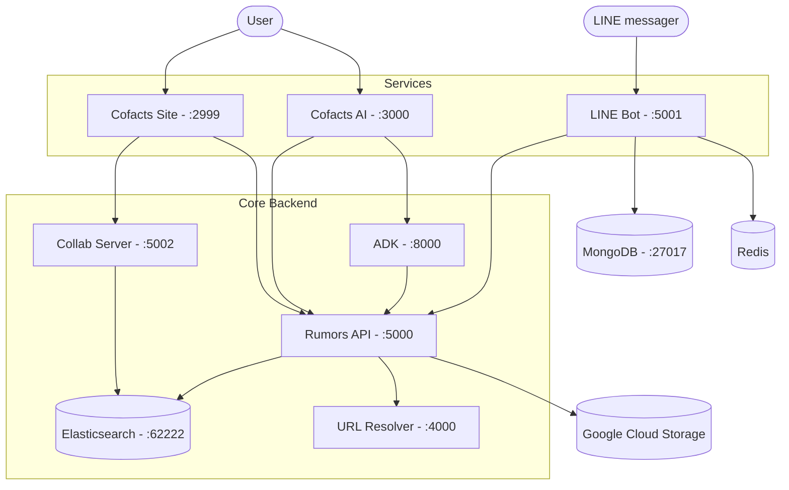

# Cofacts System Blueprint (rumors-deploy)

`rumors-deploy` is the central architecture reference and deployment template for the entire [Cofacts](https://cofacts.tw) ecosystem. It provides a minimalist, self-documenting configuration to get all Cofacts services running on a single machine for research, local development, and testing.

## Philosophy

- **System Blueprint**: This repository serves as the authoritative map of how Cofacts services interconnect.
- **Transparency**: Clear visibility of service dependencies via `docker-compose` and health checks.
- **Minimalism**: We intentionally omit production-only complexity (like Nginx reverse proxies or SSL termination) to keep the core logic accessible.
- **Reference Deployment**: It defines the "contract" between services via shared environment variables and network links.

## Architecture Overview

The following diagram illustrates how the different components of the Cofacts ecosystem interact within this deployment:



### Repositories

- [Rumors API](https://github.com/cofacts/rumors-api) - Core GraphQL API
- [Rumors DB](https://github.com/cofacts/rumors-db) - Elasticsearch index definitions and mappings
- [Cofacts Site](https://github.com/cofacts/rumors-site) - Main website (Next.js)
- [Cofacts AI & ADK](https://github.com/cofacts/ai) - AI agent platform and ADK backend
- [LINE Bot](https://github.com/cofacts/rumors-line-bot) - LINE bot backend
- [URL Resolver](https://github.com/cofacts/url-resolver) - URL metadata scraper
- [Collab Server](https://github.com/cofacts/collab-server) - Collaboration backend

## Prerequisites

1. **Docker & Docker Compose** (V2 recommended)
2. **Git**

## Quick Start

1. **Clone this project**:
   ```bash
   git clone https://github.com/cofacts/rumors-deploy.git
   cd rumors-deploy
   ```

2. **Setup environment variables**:
   Copy the sample directory and populate it with your actual values.
   ```bash
   cp -r env-files.sample env-files
   # Edit files in env-files/ with your configuration
   ```

3. **Initialize Docker Compose**:
   Copy the sample template to the active configuration.
   ```bash
   cp docker-compose.sample.yml docker-compose.yml
   # Optional: Make necessary changes to docker-compose.yml
   ```

4. **Launch the ecosystem**:
   ```bash
   docker compose up -d
   ```

## Configuration

Each service's configuration is managed via files in `env-files/`.

> [!NOTE]
> The sample files in `env-files.sample/` are kept minimal. For the most up-to-date and comprehensive environment variable documentation, please refer to the `.env.sample` files in their respective repositories (links are provided in each sample file).

## Maintenance

### Updating Images
To update a specific service (e.g., `api`):
```bash
docker compose pull api
docker compose up --no-deps -d api
```

### Applying Volume Changes
After changing configuration files mounted in `volumes/`:
```bash
docker compose restart <service-name>
```

## Production Considerations

While `rumors-deploy` provides the logical core of Cofacts, a full production deployment typically requires additional layers:
- **Reverse Proxy**: Nginx or Traefik for SSL (HTTPS) termination and domain routing.
- **Backups**: Regular snapshots of Elasticsearch and MongoDB volumes.
- **Monitoring**: Logging and metrics collection for production stability.

---
For more details on running Cofacts on a local machine, see this [guide](http://bit.ly/run-cofacts).
